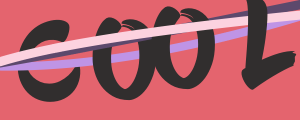

<p align="center">

</p>

<h3 align="center">CoolCaptcha</h3>

## Info

`CoolCaptcha` is a graphic captcha that I think is cool.The project makes it quick and easy to generate base64 data for captcha images, and the library can be configured to customize the style to match the style of the product.


languages: [简体中文](https://github.com/Kuari/coolCaptcha/blob/main/README.zh-CN.md) English


## Case

 

 

 


## Install

```go
go get github.com/Kuari/coolCaptcha
```


## Usage

### Quiuick Start Guide

```go
package main

import (
	"github.com/Kuari/coolCaptcha"
)

func main() {
	imageBase64Data, code, err := coolCaptcha.New().Generate()
}
```

### Custom configuration

```go
package main

import (
	"github.com/Kuari/coolCaptcha"
)

func main() {
	options := []coolCaptcha.Options{
		coolCaptcha.SetBackgroundHexColor("#c4e1f6"),                            // set the background color of the picture
		coolCaptcha.SetFontHexColor("#312E2E"),                                  // set font color
		coolCaptcha.SetLineHexColors([]string{"#f596a1", "#fadeeb", "#f9c975"}), // to set the line color, 3 bars are randomly selected from it, so this parameter sets at least 3 values
		coolCaptcha.SetWidth(300),                                               // set the width of the image
		coolCaptcha.SetHeight(120),                                              // set the height of the image
		coolCaptcha.SetCodeType(coolCaptcha.NumericCharacters),                  // set the type of authentication characters, there are three types: UppercaseEnglishCharacters, NumericCharacters, and MixedCharacters
		coolCaptcha.SetDevMode(true),                                            // Set the development module, which is suitable for saving base64 data as an image during development, so that you can easily view the generated effect
	}

	imageBase64Data, code, err := coolCaptcha.New(options...).Generate()
}
```

### Custom verification codes

You can generate images from a captcha that you generate yourself.

```go
package main

import (
	"github.com/Kuari/coolCaptcha"
)

func main() {
	// The customCode method only supports 4-character English and numbers,
	// when passing in English, it will be capitalized and then used, so when using custom characters, the output code is capitalized, please pay attention when verifying
	// all capitalization is intended to reduce the ambiguity of English letters and numbers
	imageBase64Data, code, err := coolCaptcha.New().CustomCode("cool").Generate()
}
```


## Q&A

### 1. Can the default font be free for commercial use?

The default font uses [blowbrush](https://www.dafont.com/blowbrush.font), which is free for both personal and commercial use.

And custom font settings will be opened in the future, so please stay tuned.

### 2. Can OCR be cracked?

`CoolCaptcha` has the risk of being cracked by OCR, please use it in combination with specific scenarios.

### 3. How to avoid the confusion between English letters and numbers?

`CoolCaptcha` capitalizes all English, so it is clear between English letters and numbers. You can also use `SetCodeType` to set the authentication character to be pure English characters or pure numbers.

### 4. Why was this project developed?

In some specific scenarios, graphics captcha is required, but several problems are found. First of all, most of the current captcha is familiar with each other, I think the user experience is very important, designers and front-end hard work products, it will be strange to have a different style of graphic captcha. Secondly, Go's graphics captcha library is a bit small, and I worked with a Java development engineer before, and I envy the ability to quickly output a graphics captcha. Therefore, it is engaged.
